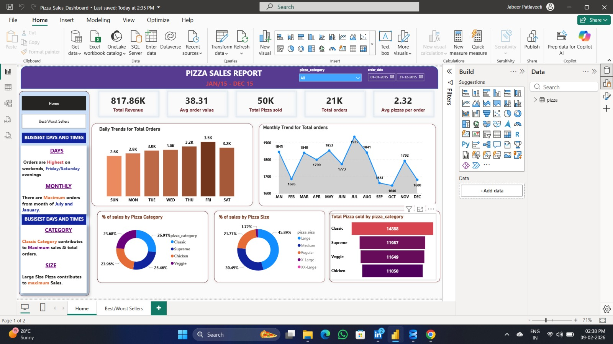
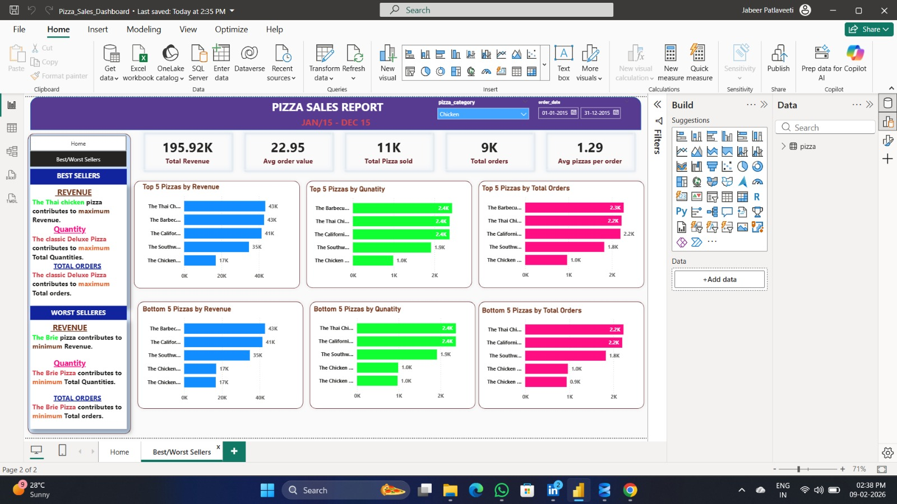

# SQL-Data-Analytics-Portfolio
A collection of advanced SQL projects focusing on data extraction, complex joins, and business intelligence. Includes the Pizza Sales Analysis (48,000+ records)

🍕 Pizza Sales Analysis (SQL Server)

Dataset: 48,000+ records of pizza orders.

🎯 Project Goal
To perform deep-dive analysis into sales trends, identify peak ordering hours, and categorize best/worst-selling products to drive a 10% projected revenue growth.

🛠️ SQL Skills Demonstrated

Joins & Aggregations: Connecting order details to product categories.

Date Functions: Extracting peak hours and daily trends from 48,000+ records.

Business Logic: Creating a "Best/Worst Sellers" reporting framework for menu optimization.

## 📊 Pizza Sales Dashboard Overview
Here is a look at the interactive dashboard built to monitor peak order times and sales performance:

## 📊 Pizza Sales Dashboard Overview
[cite_start]Visualizing peak order patterns and sales distributions from 48,000+ records.

### 1. Home Dashboard (KPI Tracking)

### 2. Best & Worst Sellers Analysis

*Note: You can download the `Pizza_Sales_Dashboard.pbix` file from this repository to explore the full interactive report.*

